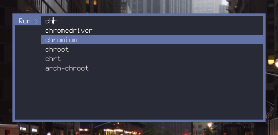

# Suckless programs
## With patches and 0x85c's customizations

These are [suckless](https://suckless.org/) programs with my selection of patches applied. As patches sometimes don't work with newer versions, or when multiple patches are applied, I have resolved all conflicts here so all patch files can be applied in the order they are listed here. Either `make clean all` the programs, or directly apply the patches yourself from the upstream suckless repo, using the same version of suckless programs I have used.

  - dmenu
  - st
  - slock

### Quickstart

#### Recommended: Build all

```
git clone git@github.com:0x85C/suckless.git
./build-all.sh
```

#### Alternative: Build all from upstream

```
git clone git@github.com:0x85C/suckless.git
./build-all-upstream.sh
```

---

### [dmenu](https://tools.suckless.org/dmenu/)

  - tag: 5.3 (commit: 7be720cc88ed2294338f7182600df10f21c575ce) *- latest as of 2024-04-13*
  - patches
    - localpaths (my own patch)
      - patches/dmenu-localpaths-5.3-0x85c.diff
    - [center](https://tools.suckless.org/dmenu/patches/center/)
      - patches/dmenu-center-5.3-0x85c.diff
    - [border](https://tools.suckless.org/dmenu/patches/border/)
      - patches/dmenu-border-5.3-0x85c.diff

#### Building this project:

```
git clone git@github.com:0x85C/suckless.git && cd ./dmenu
make clean all
```

#### Building project from upstream without this repo (not necessary):

```
git clone https://git.suckless.org/dmenu && cd ./dmenu
git checkout 5.3
mkdir ./patches # <-- copy .diff files here from ./patches directory
git apply patches/dmenu-localpaths-5.3-0x85c.diff
git apply patches/dmenu-center-5.3-0x85c.diff
git apply patches/dmenu-border-5.3-0x85c.diff
make clean all
```

#### i3 config

```
# start dmenu (a program launcher) - with center patch, and dracula color scheme
bindsym $mod+d exec --no-startup-id ~/suckless/dmenu/dmenu_run -i -c -l 10 -nb '#282a36' -nf '#f8f8f2' -sb '#6272a4' -sf '#f8f8f2'
```

#### Screenshot



---

### [st](https://st.suckless.org/)

  - tag: 0.9.2 (commit: d63b9eb90245926b531bd54b1d591adb96613e70) *- latest as of 2024-04-13*
  - patches
    - [dracula](https://st.suckless.org/patches/scrollback/)
      - patches/st-dracula-0.9.2-0x85c.diff
    - [scrollback](https://st.suckless.org/patches/scrollback/)
      - patches/st-scrollback-0.9.2-0x85c.diff
    - [scrollback-reflow](https://st.suckless.org/patches/scrollback/)
      - patches/st-scrollback-reflow-0.9.2-0x85c.diff
    - [scrollback-mouse-altscreen](https://st.suckless.org/patches/scrollback/)
      - patches/st-scrollback-mouse-altscreen-0.9.2-0x85c.diff
  
#### Building this project:

```
git clone git@github.com:0x85C/suckless.git && cd ./st
make clean all
```

#### Building project from upstream without this repo (not necessary):

```
git clone https://git.suckless.org/st && cd ./st
git checkout 0.9.2
mkdir ./patches # <-- copy .diff files here from ./patches directory
git apply patches/st-dracula-0.9.2-0x85c.diff
git apply patches/st-scrollback-0.9.2-0x85c.diff
git apply patches/st-scrollback-reflow-0.9.2-0x85c.diff
git apply patches/st-scrollback-mouse-altscreen-0.9.2-0x85c.diff
make clean all
```

#### i3 config

```
bindsym $mod+Return exec --no-startup-id ~/suckless/st/st -f "Terminus (TTF):pixelsize=14:antialias=true:autohint=true"
```

*Note: above command requires 'Terminus' font*

---

### [slock](https://tools.suckless.org/slock/)

  - tag: 1.5 (commit: 4f045545a25cc02c64bfc08d27ed2ccecb962292) *- latest as of 2024-04-13*
  - patches
    - all-black (my own patch)
      - patches/slock-all-black-1.5-0x85c.diff
  
#### Building this project:

```
git clone git@github.com:0x85C/suckless.git && cd ./slock
make clean all
```

#### Building project from upstream without this repo (not necessary):

```
git clone https://git.suckless.org/slock && cd ./slock
git checkout 1.5
mkdir ./patches # <-- copy .diff files here from ./patches directory
git apply patches/slock-all-black-1.5-0x85c.diff
make clean all
```

#### i3 config

```
exec --no-startup-id sudo xss-lock --transfer-sleep-lock -- ~/suckless/slock/slock
bindsym $mod+x exec sudo ~/suckless/slock/slock
```

*Note: update sudoers to allow slock to run as root (so slock can disable OOM killer)*
